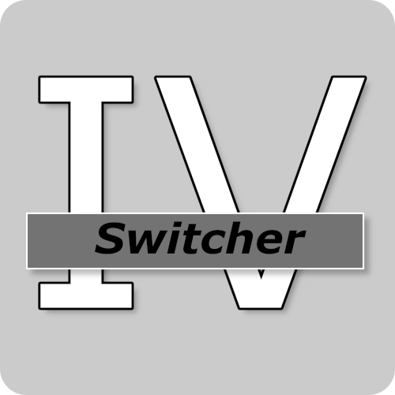

# IVSwitcher

|[English](README.md)|[日本語](README-JP.md)|

GTAVのMOD環境(ASIローダー)とオンライン環境(バニラ)を必要に応じて変更するソフト

# 要件

* Windows10 (11?)
* .NET Framework 4.7.1
* Grand Theft Auto V (Epic版動作確認済み)

# 使い方

1. `Grand Theft Auto V`フォルダ内の下記のフォルダ、ファイルをコピーし`mods`フォルダを作ってその中にコピーする

* `Update` フォルダ
* `x64` フォルダ
* `common.rpf` ファイル
* `x64a.rpf` ~ `x64w.rpf` ファイル全て

2. `Open IV`からASILoaderをインストールする

3. `IVSwitcher.exe`を実行する

*  設定で入力するURLはSteamやEpic Games Launcherからショートカットを作成し、そのショートカットのURLをコピーして貼り付ける
* ASILoaderである`dinput8.dll`はデフォルトで追加しなくてもバニラ環境で無効化されますが、それ以外の無効化したいファイルは設定で追加してください。

# 起動オプション

* `-mod` modバージョン(dll有効化)で起動
* `-online` バニラバージョン(dll無効化)で起動

# 上級者向け

生成される`settings.json`を編集することによりあとから設定の変更ができます。

* GTAV_PATH GTAVのディレクトリを指定(string)
* dlls 無効化したいファイルの一覧(list string)
* exec_url 実際に実行されるURL(string)
* use_epic EPIC Launcher使用時の設定(bool)
